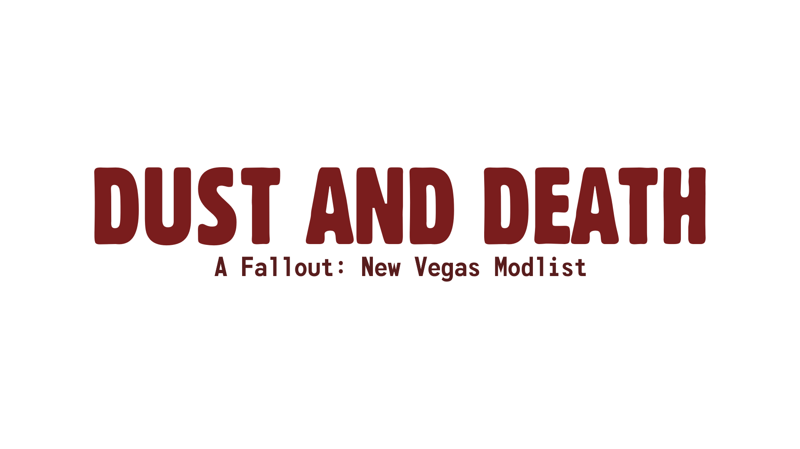

[BACK](..)

## Description

Dust and Death is a vanilla+ Wabbajack modlist that provides bugfixes and some minor gameplay and graphical tweaks. Even after all the new mods and modernization this game gets I always come back to this list to experience something more "purist".

### Post-Installation Steps
- Go to the Dust and Death separator
- Go to FNV BSA Decompressor and run the FNV BSA Decompressor.exe under the Build folder.
- In the Decompressed Archives directory and direct it towards the mod folder (ex. Dust and Death\mods\FNV BSA Decompressor). Select Decompress.
- When its done select Exit.
- Go to FNV 4GB Patcher, open the Root folder, right click on FNVpatch.exe and select Execute with VFS.
- When FalloutNV.exe is patched close out of the program.
- Move the files in Overwrite into [NoDelete] Root - Overwrite.

### Modlist Notes
Generally, this modlist will stick to the vanilla game as close as possible. However, there are some mods that will change the game as I find them refreshing.

#### Content Integration
- Sparse Starting Gear will give a small amount of gear based on the tag skills selected after leaving Doc Mitchell's house.
- DLC Weapon Integration distributes DLC weapons before going to the DLC game worlds.
- GRA Unique Weapons Relocated places Gun Runners' weaponry around the game world instead of buying them.
- Supplemental Ammo Crafting provides more ammo and breakdown recipes. Also adds categories for specific ammunition types.
- NV Collectibles - Merged will add a quest at the start of the game that tracks snowglobes.

#### Difficulty Overhaul
- Vigor is a more "vanilla" version of JSawyer's mod that increases the difficulty without being too artificial. Definitely better for players who play this game on repeat. It also integrates DLC.
	- Vigor - Expired and Homemade Stimpaks Removed gets rid of the expired and homemade stimpaks because I have found it makes the inventory already more bloated than it needs to be. This also makes the mod more "purist".
- Economy Item Values Overhaul reduces the prices for everything, while this makes buying things cheaper it also makes selling things cheaper.

#### Combat
- Weapon Jamming Tweaks makes jamming actually an issue, combined with the bAutoWeaponJamWhileFiring tweak from Stewie, this will make jamming much more common and in my opinion, improve the importance of repair even more.
- Faster Melee Recoil Animations will make melee less sluggish to play with and against.

### Adding Mods
**This modlist is provided as is and as such, no help is going to be provided when you add mods. You have been warned.**

Add new separators under the `!! YOUR MODS !!` separator to guarantee that:
- Your changes overwrite the list's.
- You know where the official list begins and where your mods end, should things end up going wrong.

[This page](https://biblioklept.github.io/guides/fnv-modules/) has mods that I believe work well with this list.

Sections covered:
- Content
- Difficulty Overhaul
- "No Pip-Boy Glove" from Character Visuals

### [Changelog](./changelog/)