# Biblioklept's Site - [HOME](https://biblioklept.github.io/) / [BACK](https://biblioklept.github.io/modlists)

## About The Guide

### Goal
The goal of this modlist is to provide a base to build upon with mods of your own choosing, whilst providing a perfectly good experience on its own, should you choose to not go any further. Initially a remake of EXPIDITION with less crashes, more vanilla assets, less overkill ReShades, and modularity, it's quickly become it's own modlist.

### First, Important, and Final Warning Before Starting
***Support will NOT be given towards people who have modified the modlist further than what's provided within the guide. Although this modlist is designed to give you the essentials for a smooth and relatively fun experience to build on with mods you want to use, I simply cannot and will not provide support for everyone's modlist setups.***

### Pre-Requisites
- [Visual C++ Runtimes](https://github.com/abbodi1406/vcredist/releases/latest)
- [DirectX Runtime Libraries](https://www.microsoft.com/en-us/download/details.aspx?id=35)
- A decent internet connection
- A computer that can run S.T.A.L.K.E.R.: Anomaly, in the words of seargedp:  
> "I recommend at least 16 GB of RAM, a recent quad-core CPU and a graphics card with at least 4 GB of VRAM, ideally at least something as powerful as a GTX 970 or higher. It's also only tested on Windows 10 and requires a 64 bit version of Windows."  

## Initial Setup

***This section was completely ripped off and converted from [Viva New Vegas](https://vivanewvegas.moddinglinked.com/setup.html). All credits to Qolore07***.

### Uninstalling the Game

> If you do not have the game installed yet, skip this step.

1.  Find where you installed `STALKER Anomaly` and delete it completely.

### Installing the Game

1.  Download [STALKER Anomaly 1.5.1](https://www.moddb.com/mods/stalker-anomaly/downloads/stalker-anomaly-151)
2.  Download [STALKER Anomaly 1.5.2](https://www.moddb.com/mods/stalker-anomaly/downloads/stalker-anomaly-151-to-152)
3.  Extract it to any location outside of any default Window folders (like `Program Files x86`)

## Post-Installation

### Key Terminology

Now that the game is installed, there are two folders from it that will be referred to in the guide often:

- **Root** folder: Where the game is installed

> Example: `D:\STALKER Anomaly\`

- **gamedata** folder: Where all of the game's assets are located

> Example: `D:\STALKER Anomaly\gamedata`

- **bin** folder: Where the executables and engine modifications are installed

> Example: `D:\STALKER Anomaly\bin`

### Quickly Running The Game

1.  Run `AnomalyLauncher.exe` from the game's `Root` folder

- If you do not know what the game's `Root` folder is, read the **Key Terminology** section above

2.  Select **DirectX 10 or DirectX 11**

- If you have a lower-end PC, or want to squeeze as much performance out of the game as possible, you can select the I'd recommend DirectX 10. It offers pretty similar lighting quality for performance improvement, especially on older hardware. **Using a lower DirectX version will result in crashes**. Another great way to improve performance is tweaking the visuals/graphics in-game and lowering the shadow map to 1536.

3.  Tick the `Reset graphics settings` box
4.  Set the `Resolution` option to your preference
5.  Click the drop-down box and choose either `Borderless Windowed` or `Fullscreen`

### Enabling File Extensions

By default, Windows Explorer will not show file extensions (such as .exe, .dll, or .esp). These extensions are very important when going through the guide, so it is highly recommended to enable file extensions:

1.  Open Windows Explorer
2.  Select the **View** tab at the top
3.  Check the box next to **File name extensions**

## Mod Organizer 2 Setup

***This section was completely ripped off and converted from [Viva New Vegas](https://vivanewvegas.moddinglinked.com/mo2.html). All credits to Qolore07***.

### Installing Mod Organizer 2

1.  Download the latest `Mod Organizer 2` file from [here](https://github.com/ModOrganizer2/modorganizer/releases/latest)
2.  Once downloaded, extract it to any location outside of any default Window folders (like `Program Files x86`) and outside of the game's `Root` folder (the installer's default location will work)

### Initial Setup

1.  Run `ModOrganizer.exe`
2.  You will be prompted with a pop-up called `Creating an instance`, in which you should just select `Next`
3.  On the next page, select `Create a portable instance`
5.  On the next page, select `STALKER Anomaly`
6.  On the next page, keep the `Location` file path default

> If you have MO2 installed on an SSD or a HDD with little space, you can check the **Show advanced options** box and change the **Downloads** file path to a different drive with more space. This will not effect download/game performance, and the downloads can be deleted after the mods have been installed.

7.  On the last page, select `Finish`
8.  MO2 will launch and prompt you with a pop-up called `Show tutorial?`, in which you should select `No`
9.  From the pop-up called `Register?`, select `Yes`

- This pop-up will not show up if you have already registered a different instance of MO2

### Configuring Settings

1.  Select the `X` in the bottom right of MO2 to close the log window
2.  Select the `Settings` button at the top of MO2 to open the settings
3.  In the **Theme** tab, you can select a different style from the drop-down menu at the top

- I use the `1809 Dark Mode` theme

4.  In the `Nexus` tab, select `Connect to Nexus`

- This option will not show up if you have already connected your Nexus account on a different MO2 instance

5.  MO2 will open your browser and prompt you to authorize the connection
6.  Once you authorize it, you can close out of your browser and of the MO2 settings
7.  Allow MO2 to restart if it asks

### Creating Profiles

Mod Organizer 2's "Profiles" feature allows for easy switching between different mod configurations. In this step, we will create a profile for the guide while keeping a strictly-vanilla profile for testing/de-bugging. Profiles can be selected via the drop-down menu above the left pane.

1.  Select the `Profiles` button at the top of MO2 to open the profiles menu
2.  Select the `Default` profile, then select `Copy`
3.  Name the new profile `JOURNEY`
4.  Select the `JOURNEY` profile and make sure both `Use profile-specific Game INI Files` is checked at the bottom

> You may get a pop-up called `INI file is read-only` when attempting to make/select a new profile. If so then select `Remember my choice` from the drop-down at the bottom then click `Clear the read-only flag`

5.  Exit out of the profiles menu and select the `JOURNEY` profile from the drop-down above the left pane

### Mod Installation Advice

1.  Click the `DOWNLOAD NOW!` button (or whatever the download button is for the respective site)

> I recommend moving the downloaded files to your JOURNEY MO2 `downloads` (i.e. `JOURNEY\downloads`) folder.

2.  Once the download has finished, click the `Archive` button at the top of MO2
3.  From the new window, navigate to where the file was downloaded to and double-click it

When downloading multiple files from the same page, you will be prompted with a box in Mod Organizer 2 with the options `Merge`, `Replace`, and `Rename`. You should select the `Rename` option and rename the mod to its respective file name. This will make MO2 install them as separate files for easier management. If you are updating from an old version of a mod, you should select `Replace`. This will delete all the files from the old version of the mod and replace them,with the ones from the new version. This is the only time you should use the `Replace` option, otherwise always use `Rename`.

> This guide will assume that from here on out you'll know how to install the mods, and will provide *mostly* image-based help if the installation requires a special process. Otherwise, install as stated above.

## Modlist Setup

### Initial Setup
To begin, you will need to download the [Anomaly Modded EXE Files](https://github.com/themrdemonized/STALKER-Anomaly-modded-exes/raw/main/STALKER-Anomaly-modded-exes.zip) and extract the files into your root STALKER Anomaly game folder.

### User Interface
[Anomaly Mod Configuration Menu](https://www.moddb.com/mods/stalker-anomaly/addons/anomaly-mod-configuration-menu)  
[Crispy Options UI](https://www.moddb.com/mods/stalker-anomaly/addons/crispy-options-ui)  
[DLTX'd Persistent MCM Configuration](https://www.moddb.com/mods/stalker-anomaly/addons/dltxs-persistent-mcm-configuration)  
[Hunger, Thirst, Sleep UI](https://www.moddb.com/mods/stalker-anomaly/addons/hunger-thirst-sleepiness-bars)  
[Crook's Faction Identification UI](https://www.moddb.com/mods/stalker-anomaly/addons/crooks-faction-identification-ui)  
[Unification - Patch replacer for Crook's Faction Identification](https://www.moddb.com/mods/stalker-anomaly/addons/unification-patch-replacer-for-crooks-faction-identification)  
[Instant Tooltip](https://www.moddb.com/mods/stalker-anomaly/addons/instant-tooltip-for-rc18-23)  
[Cost In Tooltip](https://www.moddb.com/mods/stalker-anomaly/addons/cost-in-tool-tip-u4h8-and-rc18-23)  
[Battery Warning](https://www.moddb.com/mods/stalker-anomaly/addons/batterywarning)

### Visuals
[Fixed Artefact Collision and Visuals](https://www.moddb.com/mods/stalker-anomaly/addons/fixed-artefact-collision-and-visuals-152)  
[MP-133 Fix](https://www.moddb.com/mods/stalker-anomaly/addons/mp-133-fix)  
[Glossy Surfaces and Water SSR](https://www.moddb.com/mods/stalker-anomaly/addons/glossy-surfaces-ssr)  
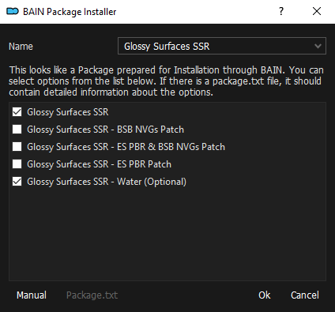  
[Fixed Vanilla Models & Textures](https://www.moddb.com/mods/stalker-anomaly/addons/fvm)  
[Dux's Innumerable Character Kit](https://www.moddb.com/mods/stalker-anomaly/addons/dick)  
> When prompted for install, select `Next`, then `Install`.

[T.H.A.P. Rework](https://www.moddb.com/mods/stalker-anomaly/addons/thap-rework)  
> When prompted for install, right click on `T.H.A.P. Rework 2.1.1` and set it as the directory.

[1st Person Visible Body](https://www.moddb.com/mods/stalker-anomaly/addons/swm-ported-visible-body-starter-version)  

### Gunplay
[Yet Another Reposition Mod](https://www.moddb.com/mods/stalker-anomaly/addons/yet-another-reposition-mod-v-1-0-melee-and-pistols)  
[Machine Pistols & Sawn Off in Sidearm Slot](https://www.moddb.com/mods/stalker-anomaly/addons/dltx-machine-pistols-sawn-off-in-sidearm-slot)  
> When prompted for install, select `OK`.

[Simple Unjam Animation](https://www.moddb.com/mods/stalker-anomaly/addons/simple-unjam-animation)  
[Lowered Sprinting Animations Optimized](https://www.moddb.com/mods/stalker-anomaly/addons/lower-weapon-sprint-optimized)  
[Sights Without Dirt/Clean Sights](https://www.moddb.com/mods/stalker-anomaly/addons/sights-without-dirt-clean-sights)  
[Shader Based 2D Scopes](https://www.moddb.com/mods/stalker-anomaly/addons/shader-based-2d-scopes-151dx11engine-mod)  
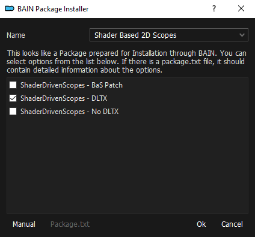  

### Gameplay
[RF Receiver Hidden Package Sidequests](https://www.moddb.com/mods/stalker-anomaly/addons/tbs-rf-receiver-hidden-package-sidequests)  
[Bounty Squads Expanded](https://www.moddb.com/mods/stalker-anomaly/addons/bounty-squads-expanded1)  
[Stealth](https://www.moddb.com/mods/stalker-anomaly/addons/stealth1)  
> When prompted for install, select `OK`.

### Tweaks
[Nitpicker's Modpack](https://www.moddb.com/mods/stalker-anomaly/addons/nitpickermodpack)  
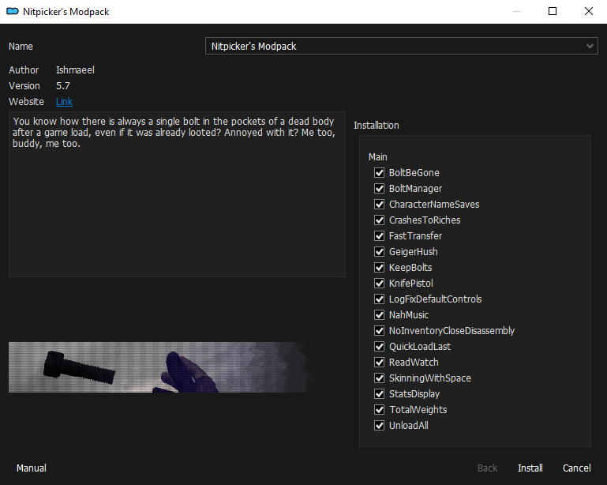  
[Modular Miscellaneous Tweaks](https://www.moddb.com/mods/stalker-anomaly/addons/modular-miscellaneous-tweaks)  
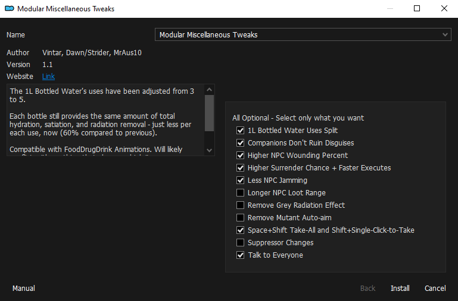  
[Crafting With Multi-Use Items Fix](https://www.moddb.com/mods/stalker-anomaly/addons/fixed-crafting-with-multi-use-items)  
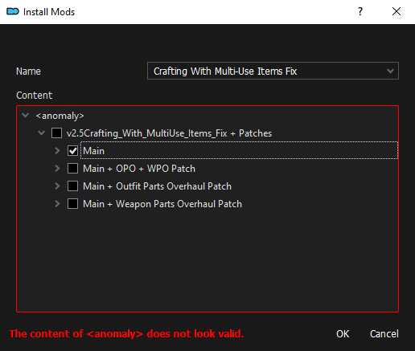  
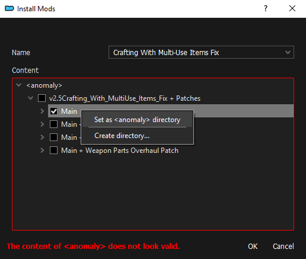  
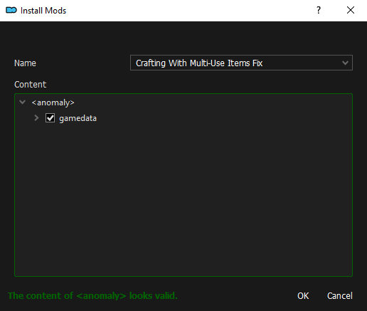  
[UNISG Hollow Boundaries Fixes](https://www.moddb.com/mods/stalker-anomaly/addons/unisg-hollow-boundaries-fixes-v110)  
[Sin Upgrade Software](https://www.moddb.com/mods/stalker-anomaly/addons/sin-upgrade-software)  
[Sin Upgrade Software - DICK Patch](./dl/Sin Upgrade Software - DICK Patch.7z)  
[Fixed Player Thermal Resistance](https://www.moddb.com/mods/stalker-anomaly/addons/fixed-player-thermal-resistance)  
[He Is With Me](https://www.moddb.com/mods/stalker-anomaly/addons/he-is-with-me)  
[Angry Chimera Growls](https://www.moddb.com/mods/stalker-anomaly/addons/tbs-angry-chimera-growls-v10)  
[Coordinate Based Safe Zones](https://www.moddb.com/mods/stalker-anomaly/addons/tb-coordinate-based-safe-zones-v1-0)  
[Fairer Thermal Anomalies](https://www.moddb.com/mods/stalker-anomaly/addons/tbs-fairer-thermal-anomalies-v1-0)  
[Companions Deactivate Headlamps When In Stealth](https://www.moddb.com/mods/stalker-anomaly/addons/tbs-companions-deactivate-headlamps-when-in-stealth)  
[475 New Stash Locations](https://www.moddb.com/mods/stalker-anomaly/addons/tbs-475-new-stash-locations)  
[Bugged Stashes Fix](https://www.moddb.com/mods/stalker-anomaly/addons/tbs-bugged-stashes-fix)  
[Transition Between Locations Without Confirmation](https://www.moddb.com/mods/stalker-anomaly/addons/transition-between-locations-without-confirmation)  

### Audio
[JSRS Sound Mod](https://www.moddb.com/mods/stalker-anomaly/addons/jsrs-sound-mod-50-preview-for-152)  
[Soundscape Overhaul](https://www.moddb.com/mods/stalker-anomaly/addons/soundscape-overhaul-2)  
[Soundscape Overhaul - Quieter Rain](https://www.moddb.com/mods/stalker-anomaly/addons/soundscape-overhaul-quieter-rain)  
[Low Health & Geiger Ticking Sounds Lowered](https://www.moddb.com/mods/stalker-anomaly/addons/low-health-geiger-ticking-sounds-lowered)  
[Noodlesmile's Better Controller Tinnitus](https://www.moddb.com/mods/stalker-anomaly/addons/noodlesmiles-better-controller-tinnitus)

### Animations
[Torch Animation Fixed](https://www.moddb.com/mods/stalker-anomaly/addons/torch-animation-fixed)  
[Faster SKS Reload](https://www.moddb.com/mods/stalker-anomaly/addons/petethegoat)  
[Camera Reanimation Project - I.N.E.R.T.I.A.](https://www.moddb.com/mods/stalker-anomaly/addons/camera-reanimation-project-inertia)   
[Damien's Animation Compendium](https://www.moddb.com/mods/stalker-anomaly/addons/damiens-animation-compedium)  
> Don't let the [Unmaintained] scare you away, the mod works perfectly fine and has for as long as 1.5.2 has been out.

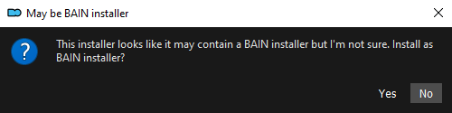  
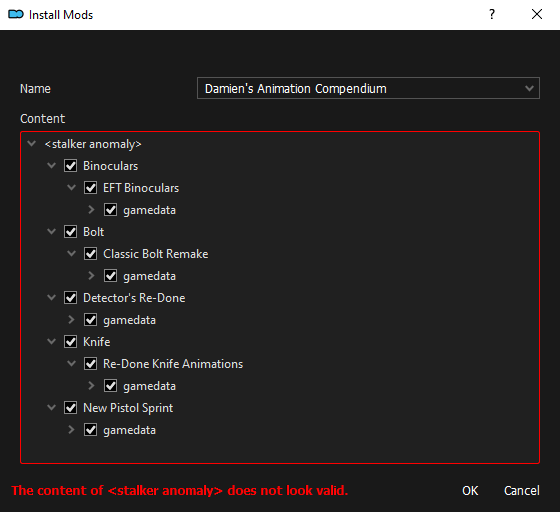  
> Move these gamedata folders to the `<stalker anomaly section>`. Then click ok. **If you installed Yet Another Reposition Mod, go to that mod, open the `mod_system_yarm_rrepo.ltx` file, and remove all references to the knife. Not doing so will cause your knife to block your vision almost completely.

[Food, Drug and Drinks Animations](https://www.moddb.com/mods/stalker-anomaly/addons/food-drug-and-drinks-animations-reuploaded)  
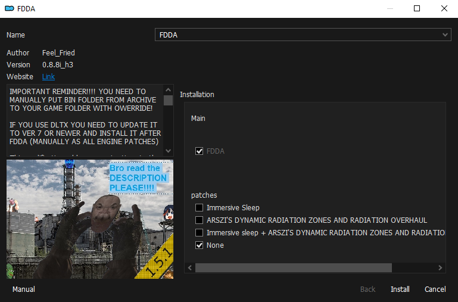  
[Asnen's Better Cigarettes Animations](https://www.moddb.com/mods/stalker-anomaly/addons/asnen-and-grok-better-cigarettes-animation)  
[Water Flask Rework](https://www.moddb.com/mods/stalker-anomaly/addons/water-flask-rework)  
[Cooking Animation System](https://www.moddb.com/mods/stalker-anomaly/addons/fieldcooker-animation-reloaded)  

### Final Steps

[AXR_Options Config](./dl/AXR_Options Config.7z)  
> All the tweaks to make the game just a little more playable. Increases your FOV, disables unnecessary animations, disables crosshair, and unlocks the rest of the factions from the start.

## Optional Mods

### Azazel Mods [OPTIONAL]
[Azazel Tweaks](https://www.moddb.com/mods/stalker-anomaly/addons/azazel-tweaks)

### Warfare Mods [OPTIONAL]
[Warfare ALife Overhaul](https://www.moddb.com/mods/stalker-anomaly/addons/warfare-alife-overhaul)  
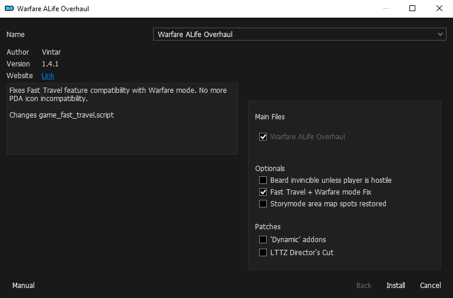  
[Hawkie's Warfare Mechanic Fix](https://www.moddb.com/mods/stalker-anomaly/addons/hawkies-warfare-mechanic-fix)

### ReShade [OPTIONAL]
1. Download [ReShade](https://reshade.me/)
2. Install ReShade by going into your S.T.A.L.K.E.R.: Anomaly `bin` folder and choosing the DX version you use.
3. Install any of these presets into your `bin` folder.

[LUSH - ReShade](https://www.moddb.com/mods/stalker-anomaly/addons/lush-reshade)  
> For a classic S.T.A.L.K.E.R. feel.

[METRO-STALKER ReShade](https://www.moddb.com/mods/stalker-anomaly/addons/metro-stalker-reshade)  
> For the Misery feel. (Disable the border.fx)
