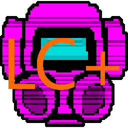

[BACK](..)

### Description
Lethal Company Plus is a modpack that aims to add as little gameplay-affecting-content as possible (the content it does add is purely cosmetic), gameplay tweaks, and quality of life mods.

### Information
There's two sets of emotes, the third person ones and the first person ones. **First-person emotes are activated with Z, third-person emotes are activated with tilde**

### Notes on mods:
RemoveMotionSway removes a huge amount of what I like to call "visual-bloat", configure or disable to your liking.

Added user interface elements:
- ShipLoot
- VoiceHUD
- LCBetterClock
- An0n_Patches
> P.S. An0n_Patches does more than just alter the HUD, edit **showHealthStamina** in `BepInEx\config\com.an0n.patch.cfg` to turn on/off the HUD elements added.

Cosmetic-based content added:
- MoreCompany
> This mod increases lobby size, but ALSO adds suits, disabling this will also disable bigger lobbies.
- More_Suits
- More_suit_colors_for_more_suits
- More_Emotes
- TooManyEmotes
> This mod does a lot, but I have configured it to give you all the emotes at the start.

Better vanilla content integration:
- Skinwalkers
- No_Shake_Spray_Paint
- LethalFashion
- BuyableShotgun
- PersistentPurchases
- BuyableShotgunShells

Important gameplay altering mods:
- BetterStamina
- PushCompany
> Recommended to disable if you have trolls frequently.
- NoPenalty
- FasterItemDropship

### Changelog

#### 1.0.1
- Updated mods and documentation.
- Added: Too Many Emotes.
> 33 mods.

#### 1.0.0
- Release
> 32 mods.