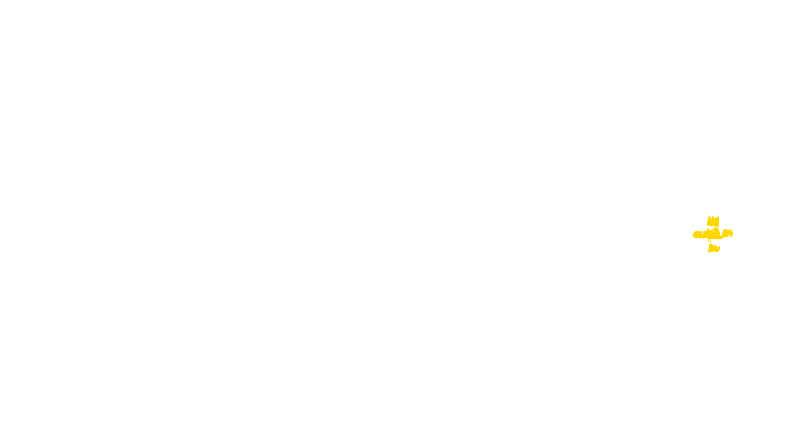

[BACK](..)

[Jump To The Guide](#modlist-setup)

## About The Guide

The goal of this modlist is to provide a base to build upon with mods of your own choosing, whilst providing a perfectly good experience on its own, should you choose to not go any further.

### First, Important, and Final Warning Before Starting
***Support will NOT be given towards people who have modified the modlist further than what's provided within the guide. Although this modlist is designed to give you the essentials for a smooth and relatively fun experience to build on with mods you want to use, I simply cannot and will not provide support for everyone's modlist setups.***

### Pre-Requisites
- [Visual C++ Runtimes](https://github.com/abbodi1406/vcredist/releases/latest)
- [DirectX Runtime Libraries](https://www.microsoft.com/en-us/download/details.aspx?id=35)
- A decent internet connection
- A computer that can run S.T.A.L.K.E.R.: Anomaly, in the words of seargedp:  
> "I recommend at least 16 GB of RAM, a recent quad-core CPU and a graphics card with at least 4 GB of VRAM, ideally at least something as powerful as a GTX 970 or higher. It's also only tested on Windows 10 and requires a 64 bit version of Windows."

## Initial Setup

***This section was completely ripped off and converted from [Viva New Vegas](https://vivanewvegas.moddinglinked.com/setup.html). All credits to the ModdingLinked team***.

### Uninstalling the Game

> If you do not have the game installed yet, skip this step.

1.  Find where you installed `STALKER Anomaly` and delete it completely.

### Installing the Game

1.  Download [STALKER Anomaly 1.5.1](https://www.moddb.com/mods/stalker-anomaly/downloads/stalker-anomaly-151)
2.  Download [STALKER Anomaly 1.5.2](https://www.moddb.com/mods/stalker-anomaly/downloads/stalker-anomaly-151-to-152)
3.  Extract it to any location outside of any default Window folders (like `Program Files x86`)

## Post-Installation

### Key Terminology

Now that the game is installed, there are two folders from it that will be referred to in the guide often:

- **Root** folder: Where the game is installed.

> Example: `D:\STALKER Anomaly\`.

- **gamedata** folder: Where all of the game's assets are located.

> Example: `D:\STALKER Anomaly\gamedata`.

- **bin** folder: Where the executables and engine modifications are installed.

> Example: `D:\STALKER Anomaly\bin`.

### Quickly Running The Game

1.  Run `AnomalyLauncher.exe` from the game's `Root` folder.

- If you do not know what the game's `Root` folder is, read the **Key Terminology** section above.

2.  Select **DirectX 10 or DirectX 11**.

- If you have a lower-end PC, or want to squeeze as much performance out of the game as possible, you can select the I'd recommend DirectX 10. It offers pretty similar lighting quality for performance improvement, especially on older hardware. **Using a lower DirectX version will result in crashes**. Another great way to improve performance is tweaking the visuals/graphics in-game and lowering the shadow map to 1536.

3.  Tick the `Reset graphics settings` box.
4.  Set the `Resolution` option to your preference.
5.  Click the drop-down box and choose either `Borderless Windowed` or `Fullscreen`.

### Enabling File Extensions

By default, Windows Explorer will not show file extensions (such as .exe, .dll, or .esp). These extensions are very important when going through the guide, so it is highly recommended to enable file extensions:

1.  Open Windows Explorer.
2.  Select the **View** tab at the top.
3.  Check the box next to **File name extensions**.

## Mod Organizer 2 Setup

***This section was completely ripped off and converted from [Viva New Vegas](https://vivanewvegas.moddinglinked.com/mo2.html). All credits to the ModdingLinked team***.

### Installing Mod Organizer 2

1.  Download the latest `Mod Organizer 2` file from [here](https://github.com/ModOrganizer2/modorganizer/releases/latest).
2.  Once downloaded, extract it to any location outside of any default Window folders (like `Program Files x86`) and outside of the game's `Root` folder (the installer's default location will work).

### Initial Setup

1.  Run `ModOrganizer.exe`.
2.  You will be prompted with a pop-up called `Creating an instance`, in which you should just select `Next`.
3.  On the next page, select `Create a portable instance`.
5.  On the next page, select `STALKER Anomaly`.
6.  On the next page, keep the `Location` file path default.

> If you have MO2 installed on an SSD or a HDD with little space, you can check the **Show advanced options** box and change the **Downloads** file path to a different drive with more space. This will not affect download/game performance, and the downloads can be deleted after the mods have been installed.

7.  On the last page, select `Finish`.
8.  MO2 will launch and prompt you with a pop-up called `Show tutorial?`, in which you should select `No`.
9.  From the pop-up called `Register?`, select `Yes`.

- This pop-up will not show up if you have already registered a different instance of MO2.

### Configuring Settings

1.  Select the `X` in the bottom right of MO2 to close the log window.
2.  Select the `Settings` button at the top of MO2 to open the settings.
3.  In the **Theme** tab, you can select a different style from the drop-down menu at the top.

- I use the `1809 Dark Mode` theme.

4.  In the `Nexus` tab, select `Connect to Nexus`.

- This option will not show up if you have already connected your Nexus account on a different MO2 instance.

5.  MO2 will open your browser and prompt you to authorize the connection.
6.  Once you authorize it, you can close out of your browser and of the MO2 settings.
7.  Allow MO2 to restart if it asks.

### Creating Profiles

Mod Organizer 2's "Profiles" feature allows for easy switching between different mod configurations. In this step, we will create a profile for the guide while keeping a strictly-vanilla profile for testing/de-bugging. Profiles can be selected via the drop-down menu above the left pane.

1.  Select the `Profiles` button at the top of MO2 to open the profiles menu.
2.  Select the `Default` profile, then select `Copy`.
3.  Name the new profile `Old World Addon Plus`.
4.  Select the `Old World Addon Plus` profile and make sure both `Use profile-specific Game INI Files` is checked at the bottom.

> You may get a pop-up called `INI file is read-only` when attempting to make/select a new profile. If so then select `Remember my choice` from the drop-down at the bottom then click `Clear the read-only flag`.

5.  Exit out of the profiles menu and select the `Old World Addon Plus` profile from the drop-down above the left pane.

### Mod Installation Advice

1.  Click the `Download` button (or whatever the download button is for the respective site).

> I recommend moving the downloaded files to your Old World Addon Plus MO2 `downloads` (i.e. `Old World Addon Plus\downloads`) folder.

2.  Once the download has finished, click the `Archive` button at the top of MO2.
3.  From the new window, navigate to where the file was downloaded to and double-click it.

When downloading multiple files from the same page, you will be prompted with a box in Mod Organizer 2 with the options `Merge`, `Replace`, and `Rename`. You should select the `Rename` option and rename the mod to its respective file name. This will make MO2 install them as separate files for easier management. If you are updating from an old version of a mod, you should select `Replace`. This will delete all the files from the old version of the mod and replace them,with the ones from the new version. This is the only time you should use the `Replace` option, otherwise always use `Rename`.

> This guide will assume that from here on out you'll know how to install the mods, and will provide *mostly* image-based help if the installation requires a special process. Otherwise, install as stated above.

## Modlist Setup

### Modded EXE Files Setup
To begin, you will need to download the [Anomaly Modded EXE Files](https://github.com/themrdemonized/STALKER-Anomaly-modded-exes/releases/latest) and extract the files into your root STALKER Anomaly game folder.

### Old World Addon - Base
[Old World Addon](https://www.moddb.com/mods/stalker-anomaly/addons/152-old-world-addon)
> Base mod, total conversion to turn Anomaly into more of a Call of Chernobyl-like experience.

### Animations
[FDDA](https://www.moddb.com/mods/stalker-anomaly/addons/food-drug-and-drinks-animations-reuploaded)
> Interactable items animations. Animations janky enough to look like it comes with the base game.

[Food, Drugs, and Drink Animations for Old World Addon](https://www.moddb.com/mods/stalker-anomaly/addons/food-drugs-and-drink-animations-for-old-world-addon]
> Gives the sausage it's animations and reskins the vodka.

[Old Backpack Model for FDDA](https://www.moddb.com/mods/stalker-anomaly/addons/old-backpack-model-for-fdda)
> Replaces the model of the backpack with the original. **Alternatively use [Classic Faction Based Backpacks](https://www.moddb.com/mods/stalker-anomaly/addons/classic-faction-based-backpacks) for faction based backpacks.**

### Visuals
[Old Dog Sleeves Hand Pack](https://www.moddb.com/mods/stalker-anomaly/addons/old-dog-sleeves)
> Replaces hands with new ones from CoP with vanilla CoP proportions.

[Throw Indicator](https://www.moddb.com/mods/stalker-anomaly/addons/151-152-throw-indicator)
> Restores the grenade/bolt throw indicator from CoP.

[AK-74 Texture Fix](https://www.moddb.com/mods/stalker-anomaly/addons/old-world-addon-ak-74-texture-fix)
> Fixes the texture of AK-74 model. **This mod requires you to make a path. Put the .dds file in: gamedata\textures\wpn\fwr_rnm_016\weapons\assault_rifles**

[Smoother Campfire Illumination](https://www.moddb.com/mods/stalker-anomaly/addons/smoother-campfire-illumination)
> Makes campfire illumination smoother and less stroboscopic.

[No Ironsights Zoom + Fixes](https://www.moddb.com/mods/stalker-anomaly/addons/old-world-addon-no-ironsights-zoom)
> Removes magnification when aiming through an ironsight and fixes some other small issues. **Install the Main mod and the Val, Vintorez , Gauss, Aksinr shoot sound fix ( VANILLA OWA ).**

[OPTIONAL - Lower Weapon Sprint Optimized](https://www.moddb.com/mods/stalker-anomaly/addons/lower-weapon-sprint-optimized)
> Lowers your weapon while sprinting, giving all weapons more consistent animations. **Using SHIFT + L will blacklist a weapon from using the lowered weapon sprinting animation, HIGHLY recommend doing this with your knife.

### Audio
[Classic Footsteps and UI SFX](https://www.moddb.com/mods/stalker-anomaly/addons/classic-foosteps-and-ui-sfx-for-owa)
> Replaces the Footstep and UI SFX with SoC/CS/CoP/CoC audio.

[Classic Mutant Sounds for Anomaly](https://www.moddb.com/mods/stalker-anomaly/addons/classic-mutant-sounds-for-anomaly)
> Replaces mutant audio with SoC/CS/CoP/CoC audio.

[OPTIONAL - S.T.A.L.K.E.R. Anomaly English Voices Complete](https://www.moddb.com/mods/stalker-anomaly/addons/english-voices-complete)
> Replace voices of special characters and normal stalkers from all 3 S.T.A.L.K.E.R. games with english variants. 

### Quality of Life
[Anomaly Mod Configuration Menu](https://www.moddb.com/mods/stalker-anomaly/addons/anomaly-mod-configuration-menu)
> A centralized place for mods to put their configuration options.

[Old World - Mod Configuration Menu (MCM) Patch](https://www.moddb.com/mods/stalker-anomaly/addons/old-world-mod-configuration-menu-mcm-patch)
> Patches Old World Addon to work with the MCM.

[Nitpicker's Modpack](https://www.moddb.com/mods/stalker-anomaly/addons/nitpickermodpack)
> A quintessential pack of essential mods. I recommend: **BoltBeGone, BoltManager, CharacterNameSaves, CrashesToRiches, FastTransfer, GeigerHush, KnifePistol, NoInventoryCloseDisassembly, QuickLoadLast, SkinningWithSpace, StatsDisplay, TotalWeights, and UnloadAll**.

[RavenAscendent Addons](https://www.moddb.com/members/ravenascendant/addons)
> Mods that add small improvements to Anomaly via scripts. I recommend: **Tool Tip In Corner, Mini Map Toggle, Sorting Plus, No More Companion Friendly Fire, Companion Carry Weight Unlimiter, Instant Tooltip, He Is With Me, Cost In Tooltop, and Body Dots Mini Map**.

[Utjan's QoL Bundle](Utjan's QoL Bundle)
> Bundle of small but significant Quality of Life mods. I recommend: **Show Total Uses, Fetch Task Shows Your Items, Weight of Category, Scroll Sort Categories, Quick Slot and Item Stack Use Priority, Show Icon On Task Items, Sleep Gain Indicator, Craft Uses Lowest Condition Items, and Devices Drain Inventory Batteries.

[Transition Between Locations Without Confirmation](https://www.moddb.com/mods/stalker-anomaly/addons/transition-between-locations-without-confirmation)
> Transition between locations without confirmation aka seamless map loading transitions.

### Gameplay

[Renegade Recreation Mod](https://www.moddb.com/mods/stalker-anomaly/addons/renegade-recreation-old-world)
> Turns Darkscape into a Renegade outpost, with a Renegade trader and mechanic.

[NPC Close Combat Enhanced](https://www.moddb.com/mods/stalker-anomaly/addons/npc-close-combat-enhanced1)
> Small script that makes NPCs pick appropriate weapons in close quarters.

[Less Chatty Experienced NPCs During Combat](https://www.moddb.com/mods/stalker-anomaly/addons/old-world-addon-less-chatty-experienced-npcs-during-combat-6-apr-2024)
> The more experienced a NPC is - the less it'll yell out combat barks.

[NPC Stops Dropping Weapons and Looting Dead Bodies](https://www.moddb.com/mods/stalker-anomaly/addons/npc-stops-dropping-and-looting-v101)
> Stops dead NPCs from dropping their weapons on the ground, also stop living NPCs from vacuuming the Zone and looting dead NPC's inventory.

[NPC Stops Dropping Weapons and Looting Dead Bodies - Old World Addon Patch](./dl/NPC Stops Dropping Weapons and Looting Dead Bodies - OWA Patch.zip)
> Patch for above mod to work with Old World Addon.

[Stealth](https://www.moddb.com/mods/stalker-anomaly/addons/stealth1)
> Changed formula for NPC's detection. It is now heavily based on light and distance. Added weight, body state, memory and many other factors. Flashlights/headlamps/campfires are now giving visibility boost to enemy. Modified luminosity itself (a lot).

[Stealth - Old World Addon Patch](./dl/Stealth - OWA Patch.zip)
> Patch for above mod to work with Old World Addon.