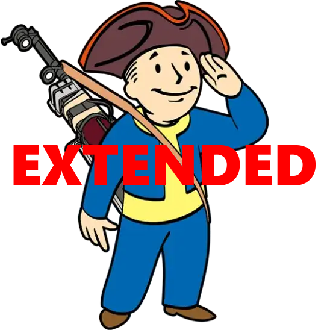

[BACK](..)

## Description
A list of mods for The Midnight Ride that aim to improve the user experience further with some more subjective mods. This guide will patch out any other gripes I had with the game post-guide installation. This list is following the understanding that you've read through [The Midnight Ride](https://themidnightride.moddinglinked.com)'s guide in its entirety.

## Making A New Profile
1. Select the MO2 profiles button at the top of MO2 to open the profiles menu.
2. Select the `The Midnight Ride` profile, then select Copy.
3. Name the new profile `The Midnight Ride Extended`.
4. Select the **The Midnight Ride Extended** profile and make sure Use profile-specific Game INI Files is Disabled at the bottom.

> Make sure the The Midnight Ride Extended profile is active before proceeding.

## Tweaks

### [SKK Fast Start New Game](https://www.nexusmods.com/fallout4/mods/29227)

#### Installation instructions:
- Main Files - SKKFastStartNewGame

Start a new game in less than 2 minutes from Main menu > Looks menu > SPECIAL menu > Outside Vault 111 with most mod added inventory items. This is a scripted bypass, not a static savegame so you get full player customisation and fresh RNG.

### [Bullet Counted Reload System (BCR) - TR Patch](https://www.nexusmods.com/fallout4/mods/41178)

### Installation instructions:
- Optional Files - BCR plus TR - Lever Action Rifle v1.00

Adds advanced BCR+TR functionality to the lever action rifle from Far Harbor.

### [Hunting Shotgun](https://www.nexusmods.com/fallout4/mods/22516)

#### Installation instructions:
- Main Files - Hunting Shotgun 2k

This mod adds pump Hunting Shotgun, which is based on famous gun from Fallout: New Vegas.

### [Hunting Shotgun - Tactical Bullet Counted Reload Patch](https://www.nexusmods.com/fallout4/mods/72206)

#### Installation instructions:
- Main Files - Hunting Shotgun - Tactical Bullet Counted Reload

This mod adds pump Hunting Shotgun, which is based on famous gun from Fallout: New Vegas.

### [Stick Mag For Submachine Gun](https://www.nexusmods.com/fallout4/mods/34516)

#### Installation instructions:
- Main Files - Stick Mag for Submachine gun

Adds two stick magazines to the vanilla Submachine gun along side custom animations for it.

### [Stick Mag For Submachine Gun](https://www.nexusmods.com/fallout4/mods/65704)

#### Installation instructions:
- Main Files - Stick Mag for Submachine gun Tactical Reload

Tactical Reload patch for Stick Mag for Submachine gun.

### [Handmade Rifle - Classic Wooden Stock](https://www.nexusmods.com/fallout4/mods/22889)

#### Installation instructions:
- Main Files - Handmade Rifle Wooden Stock

Add a custom wooden stock from an AKM DeadPool2099 made a long time ago.

### [Useful Crank - Laser Musket Doesn't Require Ammo](https://www.nexusmods.com/fallout4/mods/24349)

#### Installation instructions:
- Main Files - Useful Crank

Makes the Laser Musket not require ammo, instead it charges up ammo using the hand crank.

## Visuals

### [Scrap Metal and Makeshift Welds - A Pipe Gun Retexture](https://www.nexusmods.com/fallout4/mods/54933)

#### Installation instructions:
- Main Files - Makeshift Textures - 1K

A full retexture for the Pipe Gun series, including the pipe revolver and the Syringer.

### [Grab the Damn Mag](https://www.nexusmods.com/fallout4/mods/17299)

#### Installation instructions:
- Main Files - Grab the Damn Mag

Fixes animation clipping on a lot of modded weapons, specifically the ones that go sideways.

### [Immersive Animation Framework](https://www.nexusmods.com/fallout4/mods/50555)

#### Installation instructions:
- Main Files - Immersive Animation Framework

A full set of immersive ingestible animations.

### [Tactical Reload](https://www.nexusmods.com/fallout4/mods/49444)

#### Installation instructions:
- Main Files - Tactical Reload Framework
- Optional Files - Tactical Reload DLC Weapons
- Optional Files - Tactical Reload Vanilla Weapons

Adds a second reload for when the magazine is not empty.

### [Tactical Reload Patch Repository](https://www.nexusmods.com/fallout4/mods/52619)

#### Installation instructions:
- Main Files - Tactical Reload Patch Repository
- You will be prompted with a FOMOD installer, click next until you are in a `Compatibility Patches` section and select **Compatibility Fix** for both `Tactical Reload Vanilla Weapons` and `Tactical Reload DLC Weapons`

Patch repository for Tactical Reload.

### [Vanilla Reanimation Project - 10mm Pistol Reanimation](https://www.nexusmods.com/fallout4/mods/71932)

#### Installation instructions:
- Main Files - 10MM Pistol Reanimation Set

Reanimation for the default 10mm pistol and weapons using same animation.

### [Vanilla Reanimation Project - Double Barrel Shotgun](https://www.nexusmods.com/fallout4/mods/72640)

#### Installation instructions:
- Main Files - Double Barrel Reanimation

Reanimation for the default double barrel shotgun and weapons using same animation.

### [Vanilla Reanimation Project - Plasma Gun](https://www.nexusmods.com/fallout4/mods/72890)

#### Installation instructions:
- Main Files - Plasma Gun Reanimation

Reanimation for the default plasma gun and weapons using same animation.

### [Vanilla Reanimation Project - Hunting Rifle](https://www.nexusmods.com/fallout4/mods/72959)

#### Installation instructions:
- Main Files - Hunting Rifle Reanimation
- Optional Files - Hunting Rifle Reanimation - TR Plugin

Reanimation for the default hunting rifle and weapons using same animation.

### [Vanilla Reanimation Project - Pipe Guns](https://www.nexusmods.com/fallout4/mods/72961)

#### Installation instructions:
- Main Files - Pipe Gun Reanimation
- Optional Files - Pipe Gun Reanimation - TR Plugin

Reanimation for all the default pipe guns and weapons using same animations.

### [Vanilla Reanimation Project - Combat Rifle (and Shotgun)](https://www.nexusmods.com/fallout4/mods/73284)

#### Installation instructions:
- Main Files - Vanilla Reanimation - Combat Rifle (Shotgun)
- Optional Files - Vanilla Reanimation - Combat Rifle (Shotgun) TR

Reanimation for the default combat rifle (and shotgun) and weapons using same animation.

### [Double Action Revolver](https://www.nexusmods.com/fallout4/mods/32926)

#### Installation instructions:
- Main Files - WD_44_SA_V3

New single action animations for the .44 pistol.

### [Pistol Reanimation Pack REBORN](https://www.nexusmods.com/fallout4/mods/65468)

#### Installation instructions:
- Main Files - Pistol Reanimation Pack REBORN Hotfix 2

Makes the Deliverer use the Shiny Haxorus' animation set from ajhakra's Glock 17-18 mod!

### [Assault Rifle Reanimated](https://www.nexusmods.com/fallout4/mods/61012)

#### Installation instructions:
- Main Files - Main

A new animation set for the quote "Assault Rifle". First and 3rd person.

### [Laser Rifle Reanimation](https://www.nexusmods.com/fallout4/mods/62410)

#### Installation instructions:
- Main Files - Laser Reanimation
- Update Files - Laser Reanimation Update 1.2

Adds a new animation set for the laser rifle/pistol.

### [Random Weapon Sound Replacers](https://www.nexusmods.com/fallout4/mods/63952)

#### Installation instructions:
- Optional Files - Random Weapon Sound Replacers - Vanilla Sound Replacers

Replaces sounds with vanilla sounds.

## Final Steps

### [Load Order](./dl/plugins.txt)