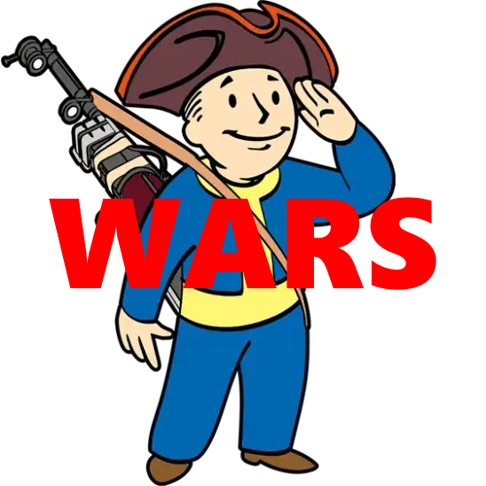

[BACK](..)

## Description
A list of mods for The Midnight Ride that aim to improve the user experience further with some more subjective mods. This guide will patch out any other gripes I had with the game post-guide installation. This list is following the understanding that you've read through [The Midnight Ride](https://themidnightride.moddinglinked.com)'s guide in its entirety.

## Making A New Profile
1. Select the MO2 profiles button at the top of MO2 to open the profiles menu.
2. Select the `The Midnight Ride` profile, then select Copy.
3. Name the new profile `The Midnight Ride WARS`.
4. Select the **The Midnight Ride WARS** profile and make sure Use profile-specific Game INI Files is Disabled at the bottom.

> Make sure the The Midnight Ride WARS profile is active before proceeding.

## Tweaks

### [SKK Fast Start New Game](https://www.nexusmods.com/fallout4/mods/29227)

#### Installation instructions:
- Main Files - SKKFastStartNewGame

Start a new game in less than 2 minutes from Main menu > Looks menu > SPECIAL menu > Outside Vault 111 with most mod added inventory items. This is a scripted bypass, not a static savegame so you get full player customisation and fresh RNG.

### [Bullet Counted Reload System (BCR) - TR Patch](https://www.nexusmods.com/fallout4/mods/41178)

### Installation instructions:
- Optional Files - BCR plus TR - Lever Action Rifle v1.00

Adds advanced BCR+TR functionality to the lever action rifle from Far Harbor.

### [Settlement Menu Manager](https://www.nexusmods.com/fallout4/mods/24204)
- Main Files - SettlementMenuManagerMainFile

SMM provides an easy way to add custom menus and makes said menus automatically disappear on uninstall (without breaking your build menu!) 

### [Lighthouse Papyrus Extender](https://www.nexusmods.com/fallout4/mods/71420)
- Main Files - Lighthouse Papyrus Extender

WARS uses functions added by Lighthouse to (among other things) make the Physical Mags system possible.

## Gameplay

### [AmmoTweaks](https://github.com/isathar/F4_AmmoTweaks/releases/latest)
- Main Files - F4_AmmoTweaks_vX.7z
- Disable all .esp files except for the Core file.

Ammo switching, additional ammo types, a weapon condition system, ammo/explosives crafting, and more.

## Visuals

### [Immersive Animation Framework](https://www.nexusmods.com/fallout4/mods/50555)

#### Installation instructions:
- Main Files - Immersive Animation Framework

A full set of immersive ingestible animations.

### [Tactical Reload](https://www.nexusmods.com/fallout4/mods/49444)

#### Installation instructions:
- Main Files - Tactical Reload Framework
- Optional Files - Tactical Reload DLC Weapons
- Optional Files - Tactical Reload Vanilla Weapons

Adds a second reload for when the magazine is not empty.

### [Tactical Reload Patch Repository](https://www.nexusmods.com/fallout4/mods/52619)

#### Installation instructions:
- Main Files - Tactical Reload Patch Repository
- You will be prompted with a FOMOD installer, click next until you are in a `Compatibility Patches` section and select **Compatibility Fix** for both `Tactical Reload Vanilla Weapons` and `Tactical Reload DLC Weapons`

Patch repository for Tactical Reload.

## WARS Mods

### [WARS - Weapon Addition and Replacement Suite](https://www.nexusmods.com/fallout4/mods/73478)
- Main Files - WARS - Weapon Addition and Replacement Suite v103

Weapon/combat overhaul. New weapons, ammo-swapping, physical mags system, weapon durability, detailed weapon and ammo manufacturing, and much more.

### [The War Room - WARS Compatibility Patches](https://www.nexusmods.com/fallout4/mods/73533)

#### Installation instructions:
- Main Files - WARS - Tactical Reload Patch v1_0_3

Patch repository for Tactical Reload.

## Final Steps

### [Load Order](./dl/plugins.txt)